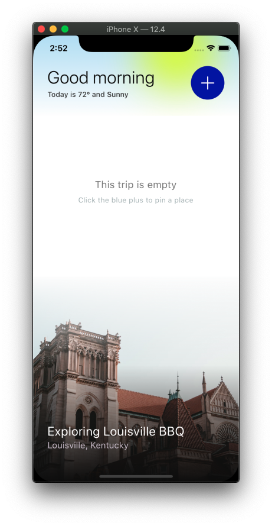
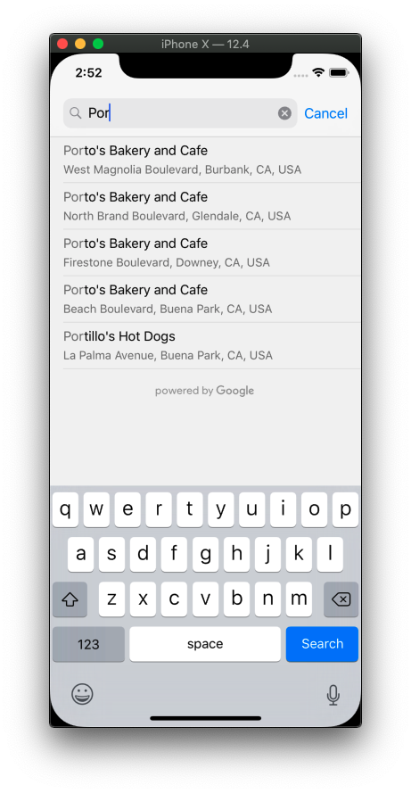
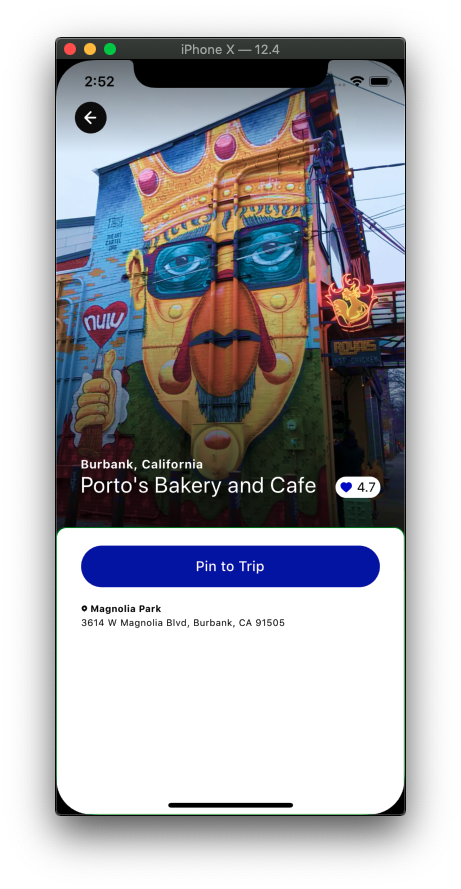
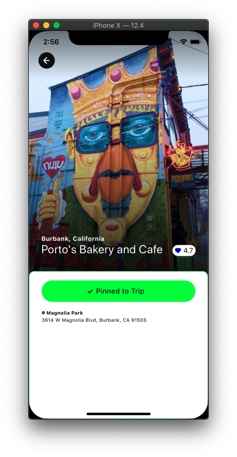

# TOC
* [Getting started](#Getting%20started)
* [Packages used](#Packages%20used)
* [Items not complete](#Items%20not%20complete)
* [Feedback](#Feedback)
* [Screenshots](#Screenshots)

# Getting started
## With Simulator... 

```
cd $REPO_ROOT
cd app
npm install
npm run ios
```
This is the same as `react-native run-ios --simulator='iPhone X'`

## With Xcode...
```
cd $REPO_ROOT
cd app
npm install
cd ios
open app.xcworkspace
```

# Packages used
* React Navigation: using this for navigation.
* Redux for state management,
* React Native Google Places to query locations.

# Items not complete
* Bookmark screen

  * Carousel of bookmarked locations.

* Place screen:

  * Integration of Google Place Photo to show a photo from a location.
  * Integration of Google Place Static Maps to show the location on a map.

# Feedback
* Although I wasn't able to complete all the tasks it was a fun assignment. Please note the following:

  * TypeScript was set up but only partially implemented.
  * My Google API key is nested inside `AppDelegate.m`. 
  * Before I found a package to make Google requests, I foolishly lost time building out a search page which I ultimately trashed. 
  * The Google package I used is a great tool but does not provide images or static maps.
  * Although I do have additional time to complete this assignement, I won't be able to take advantage of it due to work priorities. 
  * Responses from Google for a particular property where the city and state names are pulled from don't always follow the same structure which can be a headache. 
  * If time was on my side I would have liked to have added additional functionality such as: 

    * Tap `Pinned to Trip` to remove bookmark (in case it was tapped by accident).
    * DB integration to hold all bookmarked locations.

# Screenshots
<div align="center">
     
     
     
     
</div>